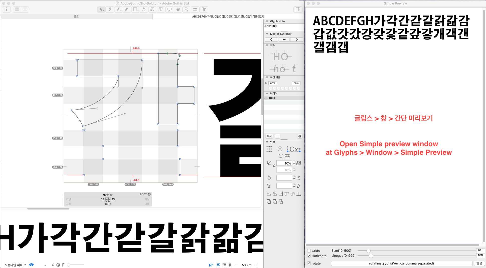
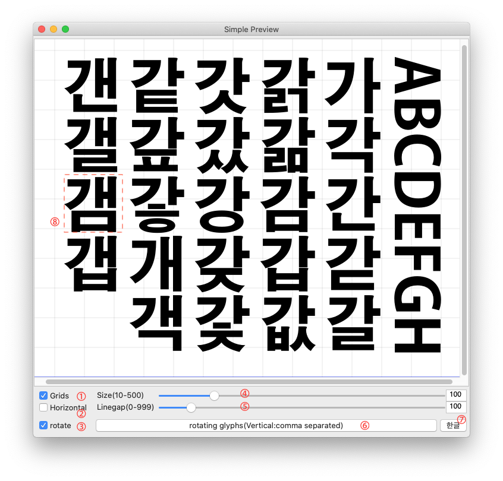
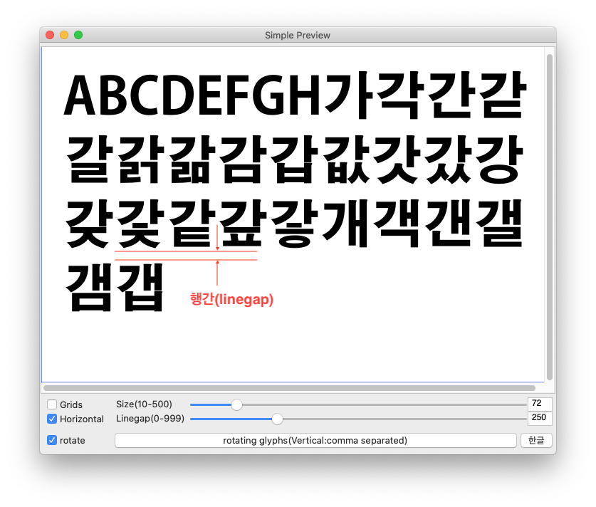
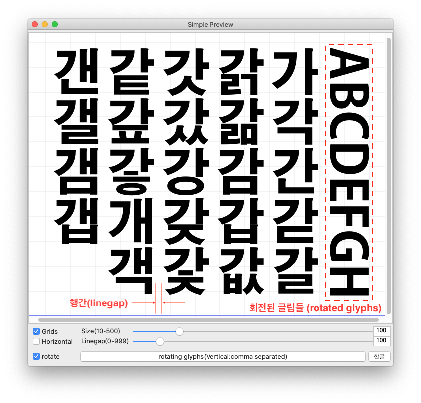
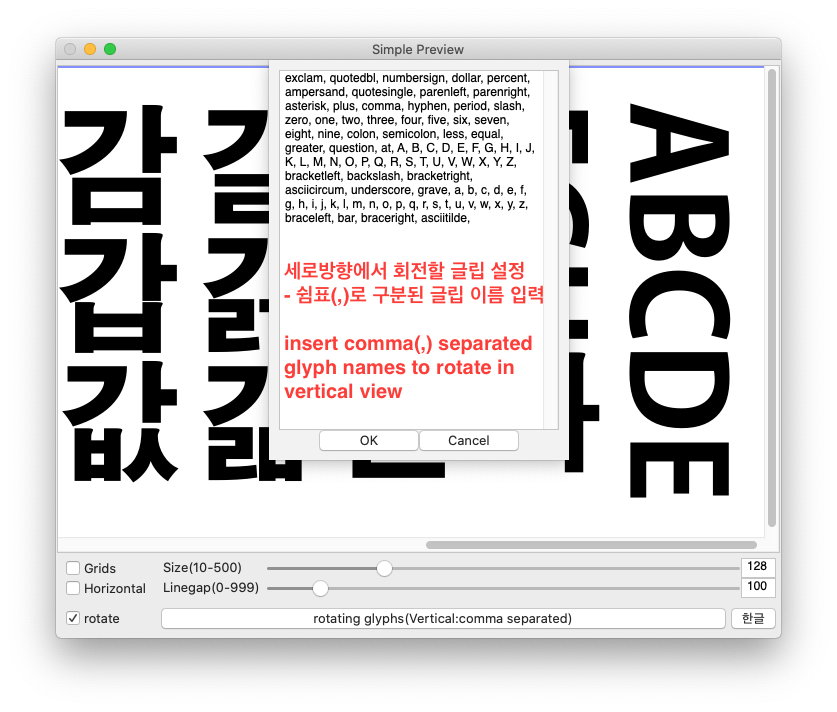

# SimplePreview_Glyphs
글립스(Glyphs)에서 글립 편집창에서 편집 중인 글립들을 미리볼 수 있는 플러그인입니다. (15일 데모 버전이며, 정식 등록은 메일로 문의해 주십시오.)

This is a plugin for Glyphs that let you preview glyphs you are editting in Glyphs' edit view. It is a demo version that works for 15 days, and you need authorization to use full versions.
if you want to use it, email me <a href="mailto:nanife@linegap.com">nanife (at) linegap.com</a> 

  
* 설명(explanations)
 
<b>① 그리드(Grids)</b> : 그리드 켜기 / 끄기 (turn on/off grids on preview window) 
<b>② 텍스트 방향(text direction: horizontal or vertical)</b> : 미리보기할 텍스트의 방향(text direction : horizontal or vertical) 
<b>③ 텍스트 회전(rotate glyphs)</b> : 세로쓰기에서 텍스트 회전해서 보기(rotate glyphs in vertical direction : texts can be set through ⑥)  
<b>④ 텍스트 크기(text size)</b> : 미리보기할 텍스트 크기(text size to preview : in 1000 upm) 
<b>⑤ 행간(linegap)</b> : 텍스트 사이의 행간(linegap value between rows or columns) 
<b>⑥ 회전할 글립들 입력(glyphs to roate in vertical mode)</b> : 세로방향에서 회전할 글립들 입력 - 글립 이름을 쉼표(,)로 구분해 복사해 붙여넣기(glyph names to roate in vertical directions : can be input with the comma(,) separated glyph names) 
<b>⑦ 언어(language)</b> : 언어 설정(language selection between Korean and English) 
<b>⑧ 글립 바로가기(open a glyph to edit)</b> : 더블클릭으로 편집할 글립 바로가기(open glyph with double click) 

<b>가로방향 보기(horizontal view)</b>

<b>세로방향 보기(vertical view)</b>

<b>세로방향에서 회전할 글립 설정(set rotating glyphs)</b>
 
세로방향에서 회전할 글립들은 폰트 창에서 글립들의 이름을 쉼표(,)로 구분하여 복사해 넣으면 된다.(insert comma(,) separated glyph names to preview rotated glyphs in vertical direction view.)

<a href="https://www.youtube.com/watch?v=4jDmnh5QufA&feature=youtu.be" target="_blank">동영상 보기 (view in youtube)</a>
